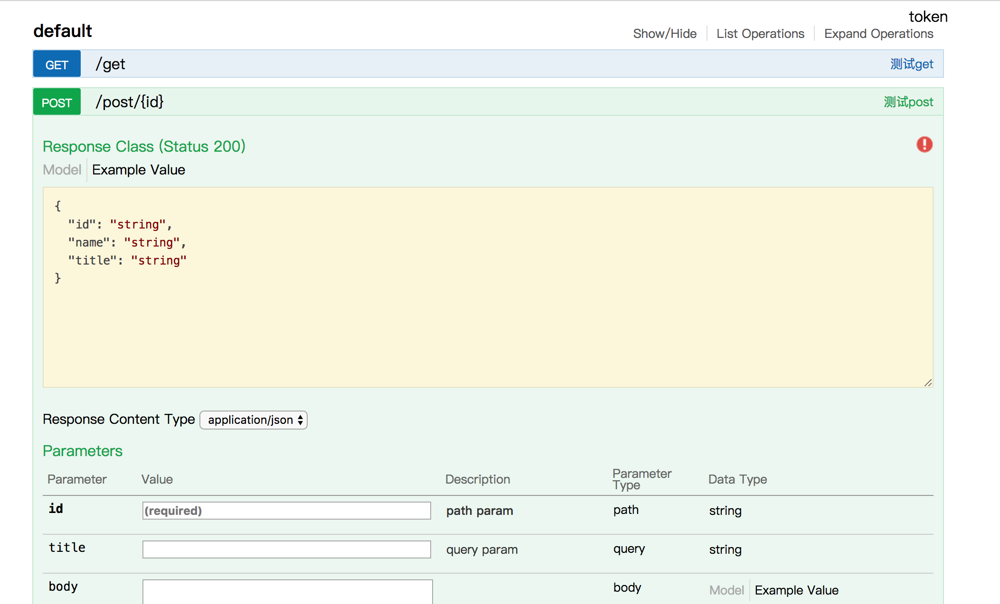

# go-swagger

## project tree

``` bash
├── api # swagger 文件夹
│   └── swagger.json
├── core # swagger生成器核心
│   ├── definition.go
│   ├── info.go
│   ├── method.go
│   ├── parameter.go
│   ├── path.go
│   ├── response.go
│   ├── router.go
│   ├── security.go
│   ├── swagger.go
│   ├── swagger_test.go
│   └── tag.go
├── swagger # swagger 对 gin 的封装
│   ├── engine.go
│   └── group.go
└── main.go # demo
```

## Quick Start

```
mkdir -p $GOPATH/src/github.com/inu1255
cd $GOPATH/src/github.com/inu1255
git clone git@github.com:inu1255/go-swagger.git
cd go-swagger
go run main.go
```
visit [http://localhost:8080/api](http://localhost:8080/api)

you will get this


### Demo
``` go
package main

import (
    "github.com/gin-gonic/gin"
    "github.com/inu1255/go-swagger/swaggin"
)

type TestBody struct {
    Name string `json:"name,omitempty" gev:"名字"`
}

type TestData struct {
    Name  string `json:"name,omitempty" gev:"名字"`
    Id    string `json:"id,omitempty" gev:"id"`
    Title string `json:"title,omitempty" gev:"标题"`
}

func main() {
    app := swaggin.New()
    app.Info("测试post")
    app.Body(new(TestBody))
    app.Data(new(TestData))
    app.PathParam("id", "path param")
    app.QueryParam("title", "query param")
    app.POST("/post/:id", func(c *gin.Context) {
        body := new(TestBody)
        if err := c.BindJSON(&body); err != nil {
            c.JSON(400, gin.H{"code": 1, "msg": err.Error()})
            return
        }
        data := new(TestData)
        data.Id = c.Param("id")
        data.Title = c.Query("title")
        data.Name = body.Name
        c.JSON(200, data)
    })
    app.Info("test get").GET("/get", func(c *gin.Context) {
        c.JSON(200, "hello world!")
    })
    app.Swagger("/api")
    app.Run()
}
```

相关项目:  

-  轻松构建restful接口 [gev](https://github.com/inu1255/gev)
-  通过swagger.json生成代码 [swaggen](https://github.com/inu1255/go-swagger/tree/master/swaggen)
