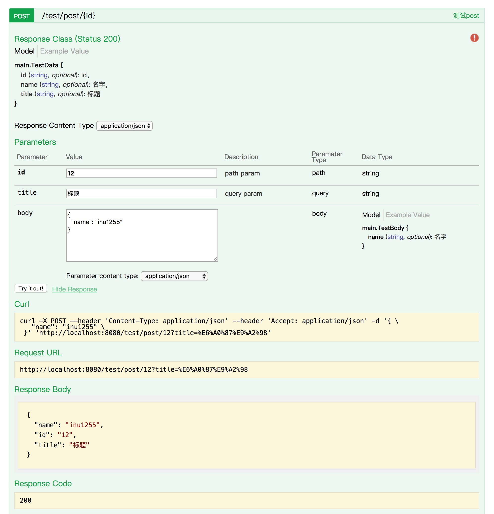

# go-swagger

``` bash
├── api # swagger 文件夹
│   └── swagger.json
├── core # swagger生成器核心
│   ├── definition.go
│   ├── info.go
│   ├── method.go
│   ├── parameter.go
│   ├── path.go
│   ├── response.go
│   ├── router.go
│   ├── security.go
│   ├── swagger.go
│   ├── swagger_test.go
│   └── tag.go
├── gin # swagger 对 gin 的封装
│   └── router.go
├── main.go # demo
└── swaggen # swagger.json 生成代码项目
    ├── README.md
    ├── base.go
    ├── entity.go
    ├── service.go
    ├── swaggen.go
    └── tmpl # golang template Demo
```

## Quick Start

```
mkdir -p $GOPATH/src/github.com/inu1255
cd $GOPATH/src/github.com/inu1255
git clone git@github.com:inu1255/go-swagger.git
cd go-swagger
go run main.go
```
visit [http://localhost:8080/api](http://localhost:8080/api)

you will get this


### Demo
``` go
package main

import (
    "github.com/gin-gonic/gin"
    swaggin "github.com/inu1255/go-swagger/gin"
)

type TestBody struct {
    Name string `json:"name,omitempty" gev:"名字"`
}

type TestData struct {
    Name  string `json:"name,omitempty" gev:"名字"`
    Id    string `json:"id,omitempty" gev:"id"`
    Title string `json:"title,omitempty" gev:"标题"`
}

func main() {
    app := gin.Default()
    test := app.Group("test")
    g := swaggin.NewRouter(test, "测试")
    {// post 接口
        g.Info("测试post").Body(
            new(TestBody),
        ).Data(
            new(TestData),
        ).Params(
            g.PathParam("id", "path param"),
            g.QueryParam("title", "query param"),
        ).POST("/post/:id", func(c *gin.Context) {
            body := new(TestBody)
            if err := c.BindJSON(&body); err != nil {
                c.JSON(400, gin.H{"code": 1, "msg": err.Error()})
                return
            }
            data := new(TestData)
            data.Id = c.Param("id")
            data.Title = c.Query("title")
            data.Name = body.Name
            c.JSON(200, data)
        })
    }
    {// get 接口
        g.Info("测试get").GET("/get", func(c *gin.Context) {
            c.JSON(200, "hello world!")
        })
    }
    swaggin.Swag.WriteJson("api/swagger.json")
    app.Static("api", "api")
    app.Run()
}
```

相关项目: [通过swagger.json生成代码](https://github.com/inu1255/go-swagger/tree/master/swaggen)